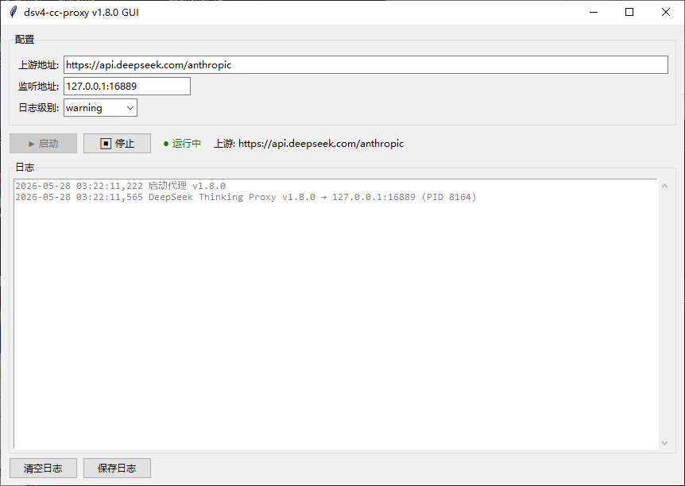

<div align="center">

# dsv4-cc-proxy-tray

**让 DeepSeek V4 在 Windows 上与 Claude Code 和 Codex CLI 无缝配合**

Anthropic API + OpenAI Responses API 兼容性代理，自带 Windows 原生图形界面 — 一键启动，无需终端。

> **源仓库:** [github.com/HosheaLi/dsv4-cc-proxy](https://github.com/HosheaLi/dsv4-cc-proxy)

```
Claude Code ←→ localhost:16889 /v1/messages    ──→ api.deepseek.com/anthropic
Codex CLI   ←→ localhost:16889 /v1/responses   ──→ api.deepseek.com/v1/chat/completions
Codex CLI   ←→ localhost:16889 /v1/chat/completions ──→ api.deepseek.com/v1/chat/completions
```

[](LICENSE)
[](https://www.python.org)
[]()



</div>

---

## 为什么需要这个代理

DeepSeek V4 存在协议不兼容问题，会导致 Claude Code 和 Codex CLI 都无法正常运行。这个代理自动路由、透明修复。

### Claude Code 修复（Anthropic Messages API）

| # | 问题 | 症状 | 修复 |
|---|------|------|------|
| 1 | tool_use assistant 消息缺少 thinking 块 | `reasoning_content` 400 错误 | 在每个 tool_use 前注入空 thinking 块 |
| 2 | DeepSeek 无条件返回 thinking/signature_delta SSE 事件 | Claude Code 报 `Tool result missing due to internal error` | 从 SSE 响应流中剥离 thinking 事件 |
| 3 | `thinking.type=adaptive`（Claude Code 默认值）+ `reasoning_effort` 不被 DeepSeek 支持 | 流式截断 / 400 错误 | 标准化为 `disabled` + 移除 reasoning_effort |

### Codex CLI 修复（OpenAI Responses API）

| # | 问题 | 症状 | 修复 |
|---|------|------|------|
| 4 | Codex 使用 Responses API (`/v1/responses`)，DeepSeek 仅提供 Chat Completions | 404 或协议不匹配 | Responses → Chat 请求转换 + SSE 反向翻译 |
| 5 | DeepSeek Chat API 在 SSE 流中返回 `reasoning_content` | Codex 可能拒绝未知字段 | 从 Chat SSE 流中剥离 reasoning_content |

非 DeepSeek 模型请求零开销透传。

## 快速开始

### 方式一：下载 exe（推荐）

从 [Releases](https://github.com/Friend-Xu/dsv4-cc-proxy/releases) 下载 `dsv4-cc-proxy-tray.exe`，双击运行。

- **无需安装 Python** — 所有依赖已打包在内
- **无黑窗** — 纯净图形界面
- **开箱即用** — 无需 pip install

### 方式二：从源码运行

```bash
pip install -e .
python dsv4_cc_proxy/gui.py
# 或直接双击
scripts\start_gui.bat
```

### 配置 Claude Code

在 `settings.local.json` 中添加：

```json
"ANTHROPIC_BASE_URL": "http://localhost:16889"
```

### 配置 Codex CLI

编辑 `~/.codex/config.toml`：

```toml
openai_base_url = "http://localhost:16889/v1"
model = "deepseek-v4-pro"
```

代理会根据请求路径自动识别并应用对应修复，无需手动切换模式。

## 图形界面功能介绍

- **一键启停** 代理服务
- **实时彩色日志** 显示，自动滚动、按日志级别着色
- **配置面板** — 上游地址、监听地址、日志级别
- **持久化配置** 保存到 `~/.dsv4-cc-proxy-tray.json`
- **跨平台进程管理** — Windows 下使用 `taskkill` 替代 POSIX 信号
- **自动路由** — 同时服务 Claude Code 和 Codex CLI

## 配置

| 环境变量 | 默认值 | 说明 |
|----------|--------|------|
| `PROXY_UPSTREAM` | `https://api.deepseek.com/anthropic` | DeepSeek API 地址 |
| `PROXY_HOST` | `127.0.0.1` | 监听地址 |
| `PROXY_PORT` | `16889` | 监听端口 |
| `PROXY_LOG_LEVEL` | `warning` | 日志级别（调试用 `info`） |
| `PROXY_DUMP_DIR` | *(空=关闭)* | 流量捕获目录。⚠ 含用户对话数据 |

## 效果对比

| 场景 | 无代理 | 有代理 |
|------|--------|--------|
| tool_use 消息缺少 thinking | 400 错误 | 自动注入空 thinking |
| Claude Code 发送 `thinking.type=adaptive` | 流截断 / 400 | 标准化为 disabled |
| DeepSeek 返回 thinking SSE 事件 | Tool result missing 错误 | 静默剥离 |
| Codex `/v1/responses` → DeepSeek | 404 / 协议不匹配 | 转换为 Chat + SSE 反向翻译 |
| DeepSeek Chat SSE 中的 reasoning_content | Codex 拒绝 | 静默剥离 |
| 非 DeepSeek 模型/端点 | — | 零开销透传 |

## 工作原理

```
┌─────────────┐     ┌──────────────────┐     ┌────────────────────┐
│ Claude Code │ ──→ │  dsv4-cc-proxy   │ ──→ │  api.deepseek.com  │
│             │     │  localhost:16889  │     │  /anthropic        │
│ Codex CLI   │ ──→ │                  │ ──→ │  /v1/chat/complet. │
└─────────────┘     └──────────────────┘     └────────────────────┘
                           │
                   ┌───────┴────────┐
                   │  五层修复        │
                   │  1. thinking    │
                   │     注入        │
                   │  2. thinking    │
                   │     标准化      │
                   │  3. SSE 事件    │
                   │     剥离        │
                   │  4. Responses↔ │
                   │     Chat 转换   │
                   │  5. reasoning   │
                   │     剥离       │
                   └────────────────┘
```

**路由分发** — 代理在 16889 端口注册 3 条路由：

| 路由 | 目标客户端 | 处理方式 |
|------|-----------|----------|
| `POST /v1/messages` | Claude Code | thinking 注入 + 标准化 + SSE 剥离 |
| `POST /v1/responses` | Codex CLI（默认） | Responses → Chat 请求转换 + SSE 反向翻译 |
| `POST /v1/chat/completions` | Codex CLI（`wire_api=chat`） | thinking 标准化 + reasoning_content 剥离 |
| `/*`（通配） | 其他所有请求 | 零开销透传 |

## 目录结构

```
.
├── dsv4_cc_proxy/
│   ├── __init__.py            # 包入口
│   ├── __main__.py            # CLI 入口
│   ├── _version.py            # VERSION = "1.8.0"
│   ├── proxy.py               # 核心代理逻辑（3 路由 + 5 修复）
│   └── gui.py                 # Windows GUI 启动器
├── tests/
│   └── test_proxy.py          # 35 个单元测试
├── scripts/
│   ├── build_exe.bat          # PyInstaller 打包脚本
│   ├── start_gui.bat          # 开发环境启动
│   ├── start.bat              # 命令行启动
│   └── start.ps1              # PowerShell 启动
├── pyproject.toml
├── .github/workflows/ci.yml
└── LICENSE
```

## 从源码构建

```bash
# 安装开发依赖
pip install -e ".[test]"

# 运行测试
pytest tests/ -v

# 构建 exe
scripts\build_exe.bat
```

## 健康检查

```bash
curl http://localhost:16889/health
# → {"status":"ok","version":"1.8.0","upstream":"https://api.deepseek.com/anthropic"}
```

## 许可证

[MIT](LICENSE)
